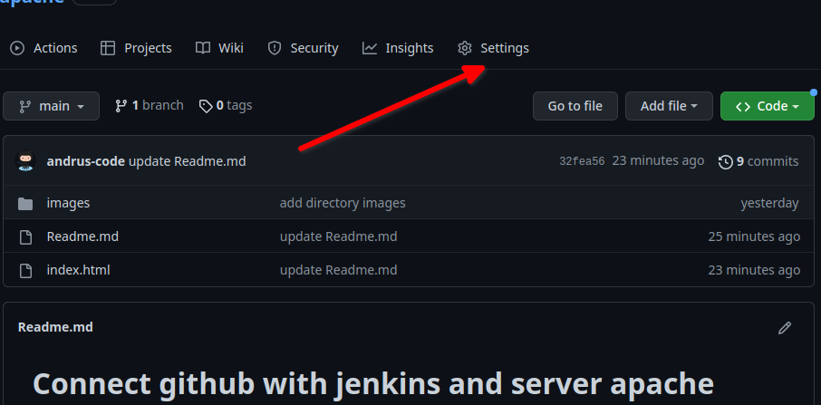

# Connect github with jenkins and server apache

Jenkins is server in my house and need to connect it with github, for that I need to open 8080 in my router 
and I need to configure Webhooks in github

1 - Connect github with jenkins 

2 - Configure jenkins to accept requests from github

* Dashboard -> Manage Jenkins -> Configure System

