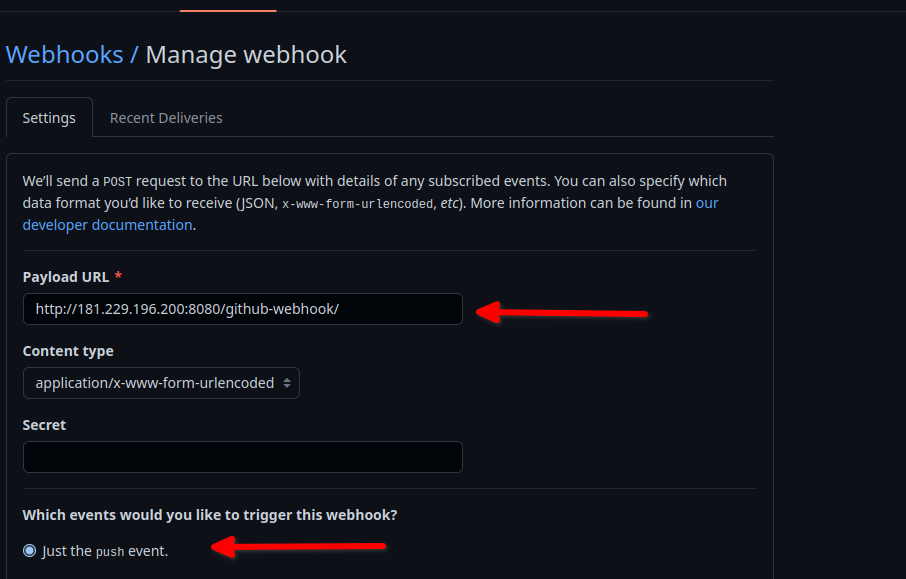

# Why Integrate Github + Jenkins 

You should integrate Jenkins and GitHub to improve the efficiency of building, testing, and deploying your code. 
The integration presented in repo will teach you how to schedule your build, pull your code and data files from your GitHub repository to your Jenkins machine, and automatically trigger each build on the Jenkins server after each Commit on your Git repository.
But first, let’s configure the Jenkins and GitHub integration. Let's begin with the GitHub side!
Jenkins is server in my house and need to connect it with github, for that I need to open 8080 in my router and I need to configure Webhooks in github

####  Configuring Github

1. Go to your Github repository and click on "Settings"

2. Clock in Webhooks and then click 'Add webhook'

3.  In the ‘Payload URL’ field, paste your Jenkins environment URL. At the end of this URL add /github-webhook/. In the ‘Content type’ select: ‘application/x-www-form-urlencoded’ and leave the ‘Secret’ field empty.

####  Configuring Jenkins

4. In Jenkins, click on ‘New Item’ to create a new project.

5. Give your project a name, then choose ‘Freestyle project’ and finally, click on ‘OK’.

6. Click on the ‘General' tab, give a description  and choose 'GitHub proyect'

7. After that, click on the ‘Source Code Management' tab and Click on Git and paste your GitHub repository URL in the ‘Repository URL’ field.

8. Change Branch master to main 

9. Click on the ‘Build Triggers’ tab and then on the ‘GitHub hook trigger for GITScm polling’. Or, choose the trigger of your choice.

That's it! Your GitHub repository is integrated with your Jenkins project. With this Jenkins GitHub integration, you can now use any file found in the GitHub repository and trigger the Jenkins job to run with every code commit.
